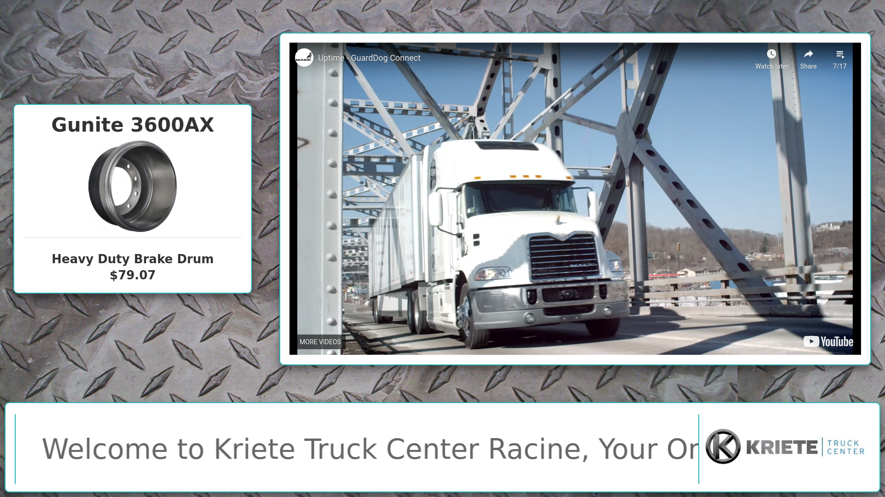

# Advertisement Website for Racine Truck Sales

This website is a fully configurable advertisement system developed for [Kriete Truck Center Racine](http://www.volvotrucks.com/dealers-vtna/en-us/milwaukeetruck/Pages/index.aspx) where it will be used at the service desk. It is powered by [Jekyll](https://jekyllrb.com/) and is intended to run fullscreen in a television browser.

You can view the live site [here](http://literacyfanatic.github.io/TruckAdvertisements/).

If you'd like to use it for your own project, all you need to do is add your own assets to the img folder and edit the settings.yml file to update the text, images, videos, and colors. While the advertisements will cycle automatially by default, the left and right arrow keys can also be used to navigate through them. This is especially useful when trying to view a specific ad to check if it is displaying properly. Additionally, the p key can be used to toggle between automatic and manual control.
